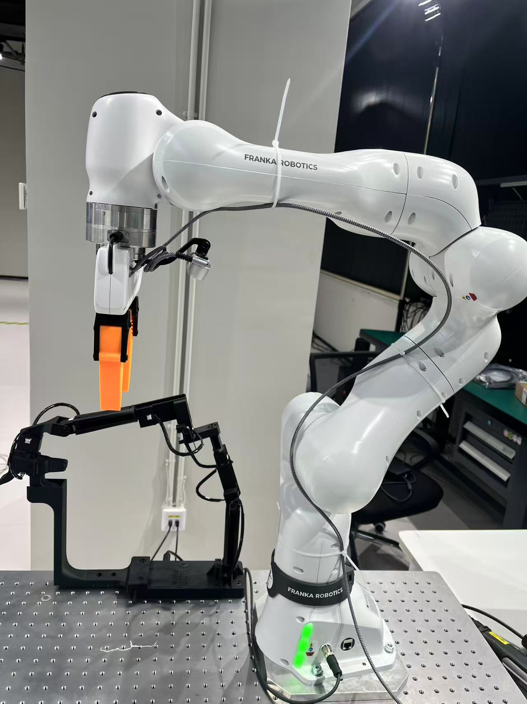
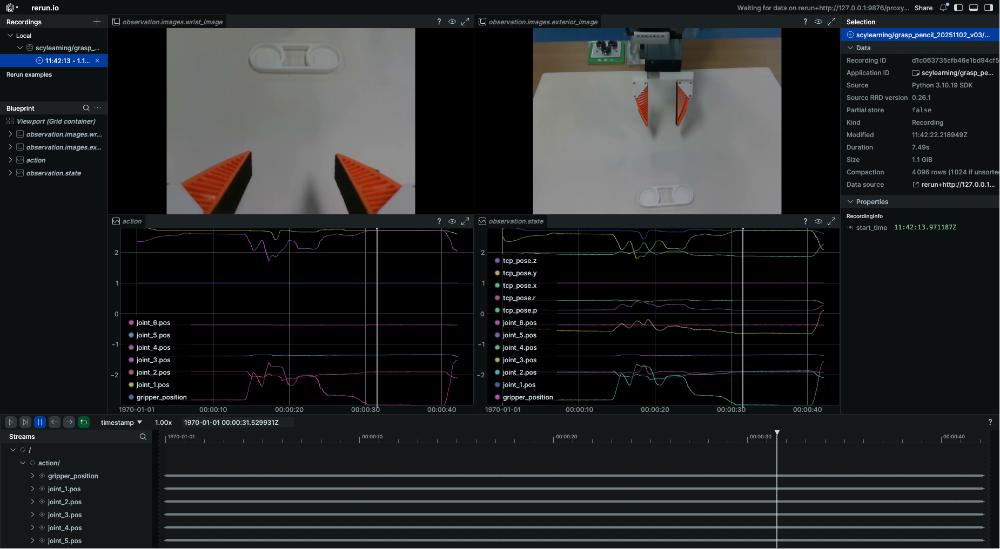

# Franka Teleoperation Data Collection with Isomorphic Joint Mapping and End-Effector Pose

## Introduction 
This project is a teleoperation data collection tool for Franka Research 3 robot (should compatible with Franka Panda), embeded in [LeRobot](https://github.com/huggingface/lerobot.git).

It supports the master-slave isomorphic joint mapping control of the robot, and collect the teleoperation data in LeRobot dataset format.

<p align="center">
  
  <br>
</p>

### New Support

Now we support the end-effector pose control using [SpaceMouse](https://3dconnexion.com/) devices.

<p align="center">
  
  <br>
</p>

 The SpaceMouse is a 6-axis input device that can be used to control the end pose of the robot. The left button is used to open the gripper, and the right button is used to close the gripper.

### New Support 2

Now we support the end-effector pose control using Oculus Quest 3/3s devices.

<p align="center">
  
  <br>
</p>

The Oculus Quest controller provides 6-DoF tracking for intuitive end-effector control. The right controller is used for robot manipulation with the following controls:

- **RG (Right Grip)**: Must be pressed to enable robot movement
- **RTr (Right Trigger)**: Controls gripper (press to close, release to open)
- **A Button**: Request robot reset
- **Right controller pose**: Controls end-effector delta pose

## 0. Franka Control Instructions

In this version, we use [Polymetis](https://polymetis-docs.github.io/) to control Franka. Since Polymetis does not support Python 3.10 and is recommended to run on NUC separately, we use Zerorpc for remote communication implementation. The specific process is as follows:

### 0.1 Install [Polymetis](https://polymetis-docs.github.io/) on NUC

We have open-sourced the optimized source code for Franka at [Polymetis](https://github.com/Shenzhaolong1330/fairo-franka/tree/main). For detailed installation instructions, please refer to [FRANKA.md](https://github.com/Shenzhaolong1330/fairo-franka/blob/main/polymetis/FRANKA.md).

### 0.2. Start Server on NUC

Start [launch_robot](https://github.com/Shenzhaolong1330/fairo-franka/blob/main/polymetis/polymetis/python/scripts/launch_robot.py), [launch_gripper](https://github.com/Shenzhaolong1330/fairo-franka/blob/main/polymetis/polymetis/python/scripts/launch_gripper.py), and [franka_interface_server](https://github.com/Shenzhaolong1330/fairo-franka/blob/main/polymetis/polymetis/python/polymetis/franka_interface_server.py) respectively.

```
# On the NUC
python launch_robot.py robot_client=franka_hardware
python launch_gripper.py gripper=franka_hand
python franka_interface_server.py
```

<!-- ### 0.3 Start [interface client](lerobot_robot_franka\lerobot_robot_franka\franka_interface_client.py) locally

Before attempting to connect to Franka, start the [interface client](lerobot_robot_franka\lerobot_robot_franka\franka_interface_client.py).

```
# On the local machine
python franka_interface_client.py
```

The functions in the [interface client](lerobot_robot_franka\lerobot_robot_franka\franka_interface_client.py) are basically the same as those in Polymetis. For usage, please refer to [Polymetis](https://polymetis-docs.github.io/).
         -->

## 1. Environment Setup
### 1.1 Create and Activate Conda Environment
```bash
conda create -n franka_data python=3.10
conda activate franka_data
```

### 1.2 Install lerobot
```bash
# Install specific version 0.3.4
# git checkout da5d2f3e9187fa4690e6667fe8b294cae49016d6
git clone https://github.com/huggingface/lerobot.git
cd lerobot
git checkout da5d2f3e9187fa4690e6667fe8b294cae49016d6
pip install -e .
```

### 1.3 Clone and Install Franka Teleoperation Control Source
```bash
mkdir franka_data_collection && cd franka_data_collection
git clone https://github.com/Shenzhaolong1330/lerobot_franka_isoteleop.git
cd lerobot_franka_isoteleop
pip install -e .
```

### 1.4 View Available Commands
Run the following command to display all available scrtips:
```bash
franka-help
# ==================================================
#  Franka Teleoperation Utilities - Command Reference
# ==================================================

# Core Commands:
#   franka-record           Record teleoperation dataset
#   franka-replay           Replay a recorded dataset
#   franka-visualize        Visualize recorded dataset
#   franka-reset           Reset the robot to initial state
#   franka-train          Train a policy on the recorded dataset

# Utility Commands:
#   utils-joint-offsets   Compute joint offsets for teleoperation

# Tool Commands:
#   tools-check-dataset   Check local dataset information
#   tools-check-rs        Retrieve connected RealSense camera serial numbers

# Shell Tools:
#   map_gripper.sh        Map Gripper Serial Port
#   check_master_port.sh  Get the Master Arm's Persistent Serial Identifier

# Test Commands:
#   test-gripper-ctrl     Run gripper control command (operate the gripper)

# --------------------------------------------------
#  Tip: Use 'franka-help' anytime to see this summary.
# ==================================================
```

## 2. Obtain and Configure Necessary Parameters

### 2.1 Get RealSense Camera Serial Number
Please make sure only one camera is connected at a time.
```bash
tools-check-rs
```
Or you can check the serial number in the realsense-viewer.
```
realsense-viewer
```

<!-- ### 2.2 Map Gripper Serial Port
For example, map the gripper to `/dev/franka_left_gripper` and make sure only one gripper USB device is connected:
```bash
map_gripper.sh franka_left_gripper
```
Next, enter the mapped device into the `gripper_port` field in `cfg.yaml`. -->

### 2.3 Get the Master Arm's Persistent Serial Identifier
Before running this, make sure only one USB device for the master arm is connected:
```bash
check_master_port.sh
```
Next, enter the obtained serial identifier into the `port` field in `record_cfg.yaml` and set device access permissions:
```bash
sudo chmod 666 <your_master_port>
```

### 2.4 Obtain Master-Slave Joint Angle Offset Circle
> **⚠️ WARNING: Before recording data, you must complete this step to set the correct joint offset. Otherwise, the slave arm may move unexpectedly.**


Manually move the master arm so that its joint angles roughly match the current joint angles of the slave arm. This is done to calculate the joint angle offset cycle between the master and slave arms. Then run:
```bash
utils-joint-offsets
```
Copy the resulting `joint_offsets` into the corresponding fields in `record_cfg.yaml`.

### 2.5 Oculus Quest Setup (For Oculus Teleoperation Mode)

If you plan to use Oculus Quest for teleoperation, follow these steps to set up the device:

#### 2.5.0 Clone Oculus Reader
```bash
cd lerobot_franka_isoteleop/lerobot_teleoperator_franka/lerobot_teleoperator_franka/oculus
git clone https://github.com/rail-berkeley/oculus_reader.git
pip install -e oculus_reader
```
after pip, you can run 
```bash
python lerobot_franka_isoteleop/lerobot_teleoperator_franka/lerobot_teleoperator_franka/oculus/oculus_reader/oculus_reader/reader.py
```
to test the Oculus Reader.

#### 2.5.1 Install ADB (Android Debug Bridge)

ADB is required for communication between Oculus Quest and the computer.

```bash
# On Ubuntu
sudo apt install android-tools-adb

# Verify installation
adb version
```

#### 2.5.2 Enable Developer Mode on Oculus Quest

1. Create or join a developer organization at [Meta for Developers](https://developer.oculus.com/manage/organizations/create/)
2. Open the Meta Quest app on your phone
3. Go to **Settings** → Select your device → **More Settings** → **Developer Mode**
4. Enable **Developer Mode** toggle

#### 2.5.3 Connect Oculus Quest to Computer

**Option A: USB Connection (Recommended for initial setup)**

1. Connect Oculus Quest to your computer using a USB-C cable
2. Put on the headset and allow USB debugging when prompted
3. Check **Always allow from this computer**
4. Verify connection:
```bash
adb devices
# Expected output:
# List of devices attached
# <device_id>    device
```

**Option B: Wireless Connection (More portable for operation)**

1. First connect via USB cable
2. Ensure both Oculus Quest and computer are on the same network
3. Get the Oculus Quest IP address:
```bash
adb shell ip route
# Look for the IP after "src", e.g., 192.168.110.62
```
4. Configure the IP in `record_cfg.yaml`:
```yaml
teleop:
  oculus_config:
    ip: "192.168.110.62"  # Your Oculus Quest IP address
```

#### 2.5.4 Install Oculus Reader APK

The Oculus Reader APK comes pre-packaged with this project. To install it:

```bash
# Navigate to the APK directory
cd lerobot_teleoperator_franka/lerobot_teleoperator_franka/oculus/oculus_reader/APK

# Install the APK to Oculus Quest
adb install -r teleop-debug.apk
```

After installation, the app will appear in your Oculus Quest library under **Unknown Sources**.

#### 2.5.5 Configure Oculus Teleoperation in record_cfg.yaml

```yaml
record:
  control_mode: "oculus"  # Set control mode to oculus
  
  teleop:
    control_mode: "oculus"
    oculus_config:
      ip: "192.168.110.62"  # Oculus Quest IP address
      use_gripper: True
      pose_scaler: [2.0, 1.5]  # [position_scale, orientation_scale]
      channel_signs: [1, 1, 1, -1, -1, 1]  # Axis direction signs [x, y, z, rx, ry, rz]
```

#### 2.5.6 Oculus Controller Controls

| Control | Function |
|---------|----------|
| **RG (Right Grip)** | Press and hold to enable robot movement |
| **RTr (Right Trigger)** | Press to close gripper, release to open |
| **A Button** | Request robot reset |
| **Right Controller Pose** | Controls end-effector delta pose |

#### 2.5.7 Coordinate System Mapping

The Oculus coordinate system is mapped to the robot coordinate system as follows:

| Oculus Axis | Robot Axis | Description |
|-------------|------------|-------------|
| X (right) | -Y (left) | Lateral movement |
| Y (up) | Z (up) | Vertical movement |
| Z (backward) | X (forward) | Forward/backward movement |

#### 2.5.8 Test Oculus Connection

Before recording, test the Oculus connection:

```python
from lerobot_teleoperator-franka.lerobot_teleoperator_franka.oculus.oculus_robot import OculusRobot

oculus = OculusRobot(ip='192.168.110.62')
while True:
    action = oculus.get_action()
    print(f"Delta pose: {action[:6]}, Gripper: {action[6]}")
```

#### 2.5.9 Troubleshooting

**Connection Issues:**
```bash
# Restart ADB server
adb kill-server
adb start-server

# Check connected devices
adb devices
```

**Stop the Oculus App:**
```bash
adb shell am force-stop com.rail.oculus.teleop
```

**Reinstall APK:**
```bash
adb uninstall com.rail.oculus.teleop
adb install -r teleop-debug.apk
```

## 3. Dataset Recording

### 3.1 Upload Data to Hugging Face (Optional)
1. Set the following in `record_cfg.yaml`:
```yaml
push_to_hub: True
```
2. Obtain your Hugging Face account token and login:
```bash
huggingface-cli login --token ${HUGGINGFACE_TOKEN} 
huggingface-cli whoami  # Verify successful login
```

### 3.2 Start Recording
1. Activate **FCI** on the Franka desk interface.  
2. Verify that the parameters in `record_cfg.yaml` are correct.  
3. To ensure standardized data collection, please read `9. Dataset Naming and Recording Details` before running the following command:
```bash
franka-record
```

<p align="center">
  
  <br>
  <b>Figure 1: Record</b>
</p>

## 4. Dataset Replay
```bash
franka-replay # Make sure record_cfg.yaml is properly configured
```

## 5. Dataset Visualization
```bash
franka-visualize # Make sure record_cfg.yaml is properly configured
```
<p align="center">
  
  <br>
  <b>Figure 2: Visualization</b>
</p>

## 6. Dataset Appending and Resume
If you have already recorded a dataset under the specified `repo_id`, set `resume: True` in `record_cfg.yaml` and enter the dataset name in `resume_dataset` to continue recording new data on the existing dataset. Then, run the following command:

```bash
franka-record
```

## 7. Merge Datasets
If you recorded data in multiple stages, ensure each dataset has a unique `repo_id`. Use the following command to merge them into a single dataset:
```bash
lerobot-edit-dataset 
    --repo_id <merged_repo_id> 
    --operation.type merge 
    --operation.repo_ids "['<repo_id_1>', '<repo_id2>']"
```
- For more dataset processing commands, see [LeRobot](https://huggingface.co/docs/lerobot/using_dataset_tools).

## 8. Recording Control Keys

- **Right Arrow Key**  
   1. Press the right arrow key: end the current episode and save the data. The program will pause.  
   2. Enter the **reset** phase: press enter key to continue (the slave arm will follow the master arm), use the master arm to return the slave arm to its initial position.  
   3. Press the right arrow key again to start recording the next episode.

- **Left Arrow Key**  
   - Press to restart the current episode recording (overwrite the current data).

- **Esc Key**  
   - Press to exit the recording session and save all recorded episodes.

- **Ctrl+C or Exception**
   - Pressing or on exception: enters exception handling and asks whether to delete the incomplete dataset.
   - If you delete the dataset by accident, you can find it in the trash folder.
  
## 9. Dataset Naming and Recording Details
### 9.1 Dataset Naming
<p align="center">
  
  <br>
  <b>Figure 3: Dataset</b>
</p>

<p align="center">
  
  <br>
  <b>Figure 4: Dataset Info</b>
</p>

1. The dataset is by default stored in the `~/.cache/huggingface/lerobot` directory and contains three types of items:

   - `dataset_info.txt`: Automatically records local dataset information, including the following fields: `record_id`, `name`, `task`, `date`, `version`, `user_info`, and `type`. The `user_info` field can be annotated via the `user_notes` entry in `record_cfg.yaml`.

   - `dataset_info_backup`: When `tools-check-dataset` is used to manually update `dataset_info.txt`, this folder stores backups of the previous records.

   - Dataset folders: Stores the actual dataset contents.

2. Dataset names follow the format `[description]_[date]_[version]`, where:
   - `description` comes from `record_cfg.yaml` as `repo_id=<user_name>/<description>`;
   - `date` is generated automatically;
   - `version` is incremented automatically if a dataset with the same `repo_id` already exists.
3. Description naming rule: `task.description -> Verb_SourceObject_prep_TargetObject`.  
   For example:  
   `Pick up the green cube and put it into the trash bin -> pick_greencube_into_trashbin`.

### 9.2 Recording Instructions
1. Complete step `2. Get and configure required parameters`.
2. Fill in the task instruction in `record_cfg.yaml` under `task.description` and set `repo_id` according to the dataset naming rules.
3. Check and adjust other parameters in `record_cfg.yaml` to ensure correctness.
4. Run `franka-record`. For safety, ensure the master and slave arm joint angles are approximately aligned; `franka-record` will automatically perform the `2.4 Master-Slave Joint Angle Error Check`. Then follow `8. Recording Control Keys` to complete the recording.
5. After recording, a `dataset_info.txt` file will be automatically created in the same directory to store local dataset information. If you have manually deleted any datasets, update the `dataset_info.txt` using:
```bash
tools-check-dataset
```

## 10. Training and Evaluation Using Collected Datasets
### 10.1 Training
Config the `train_cfg.yaml` file, including the following fields:
1. dataset_repo_id: The repository ID of the dataset to use for training.
2. policy.type: The policy type to use for training. You can choose from `diffusion` and `act`.
3. output_dir: The directory to save the training outputs.
4. job_name: The name of the training job.
5. batch_size: The batch size for training.
6. steps: The total number of training steps.

Then run the following command to start training:
```bash
franka-train
```

### 10.2 Evaluation
To evaluate the trained policy, config the `record_cfg.yaml` file, including the following fields:
1. run_mode: Set to `run_policy` to enable evaluation mode.
2. policy.type: The policy type to use for evaluation. You can choose from `diffusion` and `act`. Make sure it is the same as the policy type used for training.
3. policy.checkpoint_path: The path to the trained policy checkpoint. The path should include `config.json`.

Then run the following command to start evaluation:
```bash
franka-record
```
